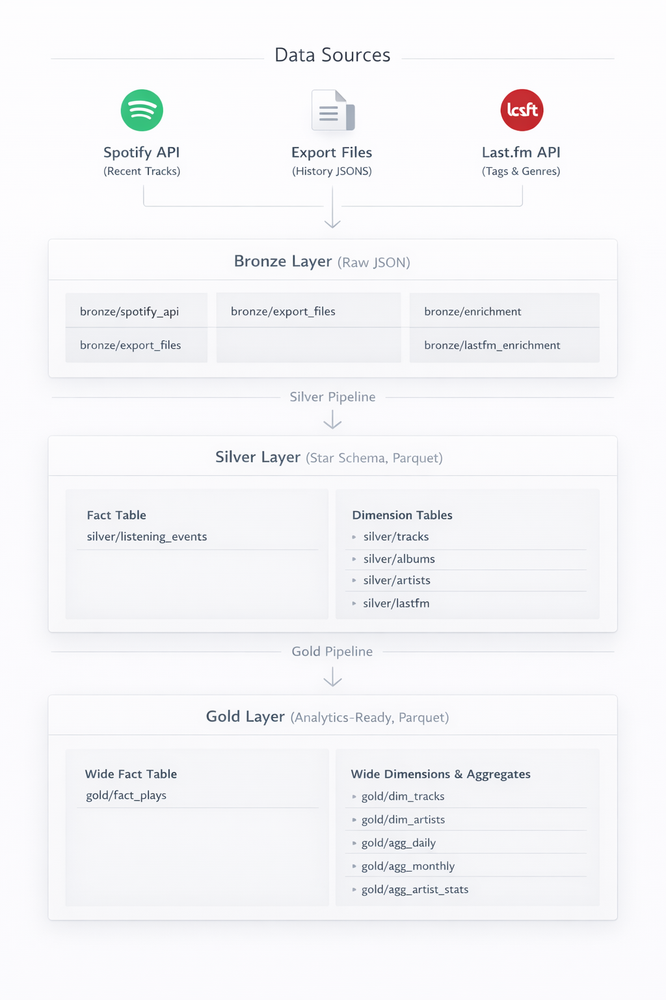

# Spotify Data Lakehouse

A data engineering project that builds a personal music analytics lakehouse based on Spotify listening history.
The pipeline ingests data from multiple sources, including the Spotify API, historical exports, extended historical exports, and Last.fm API. The project is set to be deployed on Microsoft Azure using a medallion architecture (Bronze, Silver, Gold).

The goal is to enable deep insights into listening habits, artist trends, and music preferences over time, with hourly data updates.

## Architecture



**Storage**: Azure Data Lake Storage Gen2 with Hive-partitioned Parquet files.

**Compute**: Azure Container Apps Jobs running on a cron schedule (ingest at :05, transform at :20 every hour).

**Processing**: Polars for all DataFrame operations, Pydantic for data validation.

## Project Structure

```
.
├── src/               # Application code (CLI, connectors, pipelines)
├── infra/             # Terraform modules (storage, registry, identity, compute)
├── scripts/           # Deployment script
├── tests/
├── docs/              # Detailed documentation
├── Dockerfile
├── docker-compose.yml # Azurite emulator for local dev
└── pyproject.toml
```

## Prerequisites

- Python 3.10+
- [uv](https://github.com/astral-sh/uv) package manager
- A [Spotify Developer](https://developer.spotify.com/dashboard) application with a refresh token
- Azure CLI (`az`) for LOCAL/PROD modes
- Docker for DEV mode or deployment
- Terraform for infrastructure provisioning

## Setup

```bash
# Install dependencies
uv sync

# Copy and fill environment variables
cp .env.example .env
```

The project supports three environment modes:

| Mode | Auth | When to use |
|---|---|---|
| `DEV` | Azurite emulator | Local development without Azure |
| `LOCAL` | Azure CLI (`az login`) | Development against real Azure resources |
| `PROD` | Managed Identity | Running in Azure Container Apps |

For DEV mode, we need to start the Azurite storage emulator:
```bash
docker compose up -d
```

## Usage

All commands are run through the Typer CLI:

```bash
# Fetch recent tracks from Spotify API
uv run python -m src.main ingest

# Upload historical Spotify export files
uv run python -m src.main backfill --data-dir /data/

# Transform Bronze to Silver star schema
uv run python -m src.main transform

# Build Gold analytics layer
uv run python -m src.main gold

# Run transform then gold (used by scheduled jobs)
uv run python -m src.main transform-gold

# Enrichment (local only, slow due to API rate limits)
uv run python -m src.main enrich --batch-size 10000
uv run python -m src.main enrich-lastfm
uv run python -m src.main enrich-dumps /data/dumps
```

## Deployment

Infrastructure is provisioned with Terraform and the application is deployed as a Docker image to Azure Container Registry.

```bash
# Provision infrastructure
cd infra
cp terraform.tfvars.example terraform.tfvars  # edit with real values
terraform init && terraform apply

# Deploy (build, push, update jobs)
bash scripts/deploy.sh         # uses tag "latest" par default
bash scripts/deploy.sh 0.2.0   # or a specific version
```

After the first `terraform apply`, Spotify secrets must be added to Key Vault manually:
```bash
az keyvault secret set --vault-name kv-spotify-de-prod --name SPOTIFY-CLIENT-ID --value "..."
az keyvault secret set --vault-name kv-spotify-de-prod --name SPOTIFY-CLIENT-SECRET --value "..."
az keyvault secret set --vault-name kv-spotify-de-prod --name SPOTIFY-REFRESH-TOKEN --value "..."
```

## Documentation

Detailed documentation is in the [docs/](docs/) folder:

- [infra.md](docs/infra.md) for Infrastructure: Terraform modules, Azure resources, security model, deployment reference.
- [src.md](docs/src.md) for Source code: configuration, connectors, all pipelines, design decisions.
- [data_raw_bronze_layer.md](docs/data_raw_bronze_layer.md) for Bronze layer data model (raw JSON structure from each source).
- [data_model_silver_layer.md](docs/data_model_silver_layer.md) for Silver layer data model (star schema with dimensions and fact table).
- [data_model_gold_layer.md](docs/data_model_gold_layer.md) for Gold layer data model (analytics dimensions, wide fact table, aggregations).
